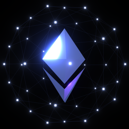

<div align="center">
  <a href="https://ethstar.dev">
    
  </a>

  <h1>Ethstar</h1>
  <p>One-click tool to star all core Ethereum protocol GitHub repositories.</p>

  [](https://github.com/AntiD2ta/ethstar/actions/workflows/ci.yml)
  [](https://goreportcard.com/report/github.com/AntiD2ta/ethstar)
  [](https://scorecard.dev/viewer/?uri=github.com/AntiD2ta/ethstar)
  [](https://go.dev/)
  [](https://snyk.io/test/github/AntiD2ta/ethstar)
  [](LICENSE)
  [](https://ethstar.dev)
</div>

---

Authenticate with GitHub, click "Star All", and support the open-source ecosystem in seconds.

**[ethstar.dev](https://ethstar.dev)**

## Repositories (58)

### Ethereum Core

Foundational protocol repositories: the EVM specification, EIPs, core protocol libraries, and cross-layer API clients.

| Repository | Description |
|---|---|
| [ethereum/go-ethereum](https://github.com/ethereum/go-ethereum) | Go implementation of the Ethereum protocol |
| [ethereum/solidity](https://github.com/ethereum/solidity) | Solidity, the Smart Contract Programming Language |
| [ethereum/EIPs](https://github.com/ethereum/EIPs) | The Ethereum Improvement Proposal repository |
| [attestantio/go-eth2-client](https://github.com/attestantio/go-eth2-client) | Go client for Ethereum consensus layer APIs |

### Consensus Clients

Beacon chain / consensus layer client implementations.

| Repository | Description |
|---|---|
| [prysmaticlabs/prysm](https://github.com/prysmaticlabs/prysm) | Ethereum consensus client written in Go |
| [sigp/lighthouse](https://github.com/sigp/lighthouse) | Ethereum consensus client written in Rust |
| [ChainSafe/lodestar](https://github.com/ChainSafe/lodestar) | Ethereum consensus client written in TypeScript |
| [status-im/nimbus-eth2](https://github.com/status-im/nimbus-eth2) | Ethereum consensus client written in Nim |
| [ConsenSys/teku](https://github.com/ConsenSys/teku) | Ethereum consensus client written in Java |
| [grandinetech/grandine](https://github.com/grandinetech/grandine) | High performance Ethereum consensus client written in Rust |

### Execution Clients

Execution layer client implementations.

| Repository | Description |
|---|---|
| [NethermindEth/nethermind](https://github.com/NethermindEth/nethermind) | Ethereum execution client written in C#/.NET |
| [erigontech/erigon](https://github.com/erigontech/erigon) | Ethereum execution client written in Go |
| [hyperledger/besu](https://github.com/hyperledger/besu) | Ethereum execution client written in Java |
| [paradigmxyz/reth](https://github.com/paradigmxyz/reth) | Ethereum execution client written in Rust |

### Validator Tooling

Validator clients, remote signers, distributed validator middleware, node setup/management tools, monitoring, and infrastructure utilities for stakers and operators.

| Repository | Description |
|---|---|
| [attestantio/vouch](https://github.com/attestantio/vouch) | Multi-node Ethereum validator client |
| [attestantio/dirk](https://github.com/attestantio/dirk) | Ethereum distributed remote keymanager |
| [ConsenSys/web3signer](https://github.com/ConsenSys/web3signer) | Remote signing service for Ethereum validators |
| [ObolNetwork/charon](https://github.com/ObolNetwork/charon) | Distributed validator middleware for Ethereum |
| [eth-educators/eth-docker](https://github.com/eth-educators/eth-docker) | Docker automation for Ethereum nodes |
| [NethermindEth/sedge](https://github.com/NethermindEth/sedge) | One-click Ethereum node setup tool |
| [dappnode/DAppNode](https://github.com/dappnode/DAppNode) | General purpose node management platform |
| [coincashew/EthPillar](https://github.com/coincashew/EthPillar) | Ethereum staking node setup tool and management TUI |
| [stereum-dev/ethereum-node](https://github.com/stereum-dev/ethereum-node) | Ethereum node setup and manager with GUI |
| [ethpandaops/ethereum-package](https://github.com/ethpandaops/ethereum-package) | Kurtosis package for portable Ethereum devnets |
| [ethpandaops/ethereum-helm-charts](https://github.com/ethpandaops/ethereum-helm-charts) | Helm charts for Ethereum blockchain on Kubernetes |
| [ethpandaops/checkpointz](https://github.com/ethpandaops/checkpointz) | Ethereum beacon chain checkpoint sync provider |
| [ethpandaops/dora](https://github.com/ethpandaops/dora) | Lightweight slot explorer for the Ethereum beacon chain |
| [ethpandaops/ethereum-metrics-exporter](https://github.com/ethpandaops/ethereum-metrics-exporter) | Prometheus exporter for Ethereum clients |
| [lidofinance/ethereum-validators-monitoring](https://github.com/lidofinance/ethereum-validators-monitoring) | Ethereum validators monitoring bot |
| [ssvlabs/ssv](https://github.com/ssvlabs/ssv) | Secret-Shared-Validator for Ethereum staking |
| [serenita-org/vero](https://github.com/serenita-org/vero) | Multi-node validator client for Ethereum |
| [wealdtech/ethdo](https://github.com/wealdtech/ethdo) | CLI for Ethereum staking operations |
| [migalabs/goteth](https://github.com/migalabs/goteth) | Ethereum chain metrics indexer for CL and EL |
| [migalabs/armiarma](https://github.com/migalabs/armiarma) | Libp2p network crawler focused on Ethereum's consensus layer |

### DeFi & Smart Contracts

Foundational DeFi protocol contracts, liquidity venues, stablecoins, cross-chain infrastructure, and analytics.

| Repository | Description |
|---|---|
| [0xProject/0x-settler](https://github.com/0xProject/0x-settler) | 0x settlement contracts using Permit2 |
| [aave/aave-v4](https://github.com/aave/aave-v4) | Aave V4 protocol contracts |
| [aave/interface](https://github.com/aave/interface) | Interface to access the Aave Protocol |
| [Uniswap/v4-core](https://github.com/Uniswap/v4-core) | Core smart contracts of Uniswap v4 |
| [1inch/aqua](https://github.com/1inch/aqua) | Shared liquidity layer protocol by 1inch |
| [1inch/limit-order-protocol](https://github.com/1inch/limit-order-protocol) | 1inch limit order protocol smart contracts |
| [across-protocol/contracts](https://github.com/across-protocol/contracts) | Smart contracts for Across protocol |
| [across-protocol/relayer](https://github.com/across-protocol/relayer) | Across Protocol bots and relayer infrastructure |
| [morpho-org/morpho-blue](https://github.com/morpho-org/morpho-blue) | Morpho variable rate lending market |
| [morpho-org/vault-v2](https://github.com/morpho-org/vault-v2) | Morpho Vault V2 contracts |
| [balancer/balancer-v3-monorepo](https://github.com/balancer/balancer-v3-monorepo) | Balancer v3 protocol monorepo |
| [curvefi/curve-stablecoin](https://github.com/curvefi/curve-stablecoin) | Curve stablecoin powered by LLAMMAs |
| [DefiLlama/defillama-server](https://github.com/DefiLlama/defillama-server) | Backend server for DefiLlama analytics |
| [DefiLlama/chainlist](https://github.com/DefiLlama/chainlist) | Community-maintained list of EVM chains |
| [DefiLlama/defillama-app](https://github.com/DefiLlama/defillama-app) | DefiLlama frontend application |
| [circlefin/evm-cctp-contracts](https://github.com/circlefin/evm-cctp-contracts) | EVM smart contracts for Circle's Cross-Chain Transfer Protocol |
| [circlefin/stablecoin-evm](https://github.com/circlefin/stablecoin-evm) | Smart contracts for Circle's EVM stablecoins |
| [circlefin/malachite](https://github.com/circlefin/malachite) | Flexible BFT consensus engine in Rust |
| [EkuboProtocol/evm-contracts](https://github.com/EkuboProtocol/evm-contracts) | Smart contracts for Ekubo Protocol on EVM |
| [lidofinance/core](https://github.com/lidofinance/core) | Lido DAO smart contracts |
| [compound-finance/compound-protocol](https://github.com/compound-finance/compound-protocol) | The Compound on-chain lending protocol |
| [cowprotocol/cowswap](https://github.com/cowprotocol/cowswap) | CowSwap UI for CoW Protocol |
| [euler-xyz/ethereum-vault-connector](https://github.com/euler-xyz/ethereum-vault-connector) | Mediator between Euler vaults with borrowing functionality |
| [euler-xyz/euler-vault-kit](https://github.com/euler-xyz/euler-vault-kit) | Build lending vaults connected via the Ethereum Vault Connector |

## Want to add a repo?

Open a PR! The [PR template](.github/pull_request_template.md) includes a checklist, and the [category descriptions](MAINTAINERS.md#categories) explain where each repo belongs.

## Token Transparency

Ethstar uses **two separate OAuth flows** with different permission scopes:

| Flow | Type | Scope | Stored? | Purpose |
|---|---|---|---|---|
| **Sign in** | GitHub App | `Starring` (read-only) | localStorage | Check which repos you've already starred |
| **Star All** | Classic OAuth | `public_repo` | Never | Star repos on your behalf, then discard |

### Ephemeral star token lifecycle

When you click "Star All", a **one-time popup OAuth flow** obtains a token that is used immediately and discarded. Here is the exact code path — every step links to the source so you can verify:

1. **Popup opens** — [`use-star-oauth.ts`](frontend/src/hooks/use-star-oauth.ts) calls `window.open("/api/auth/star")`
2. **Server redirects to GitHub** — [`api/auth/star/index.go`](api/auth/star/index.go) generates a CSRF state cookie and redirects to GitHub's OAuth page with `scope=public_repo`
3. **You authorize** — GitHub shows what permissions are requested (starring public repos)
4. **GitHub redirects back** — [`api/auth/star-callback/index.go`](api/auth/star-callback/index.go) exchanges the authorization code for an access token via [`pkg/auth/oauth.go`](pkg/auth/oauth.go), then renders an HTML page that posts the token to the opener window
5. **Token delivered via `postMessage`** — [`pkg/auth/starhtml.go`](pkg/auth/starhtml.go) sends `{type: "ethstar-star-token", access_token}` to the parent window; [`use-star-oauth.ts`](frontend/src/hooks/use-star-oauth.ts) validates the origin and message type
6. **Token used to star repos** — [`use-stars.ts`](frontend/src/hooks/use-stars.ts) passes the token to [`github.ts`](frontend/src/lib/github.ts), which calls `PUT /user/starred/{owner}/{repo}` on GitHub's API for each unstarred repo
7. **Token discarded** — the token is a local JavaScript variable; once `starAll()` returns, it falls out of scope and is garbage collected. It is **never** stored in localStorage, sent to any backend, or logged

### What the token is NOT used for

- **Not stored** — not written to localStorage, cookies, or any persistent storage
- **Not sent to our servers** — all starring API calls go directly from your browser to `api.github.com`
- **Not logged** — no `console.log`, no analytics, no telemetry
- **Not refreshable** — if the token expires mid-operation, the flow fails gracefully (no refresh attempt for ephemeral tokens)

The UI explicitly confirms this: after starring completes, the [`star-modal.tsx`](frontend/src/components/star-modal.tsx) dialog displays "Your GitHub token has been discarded."

## Development

```bash
make install          # Install dependencies
make dev-go           # Go API on :8080 (terminal 1)
make dev-frontend     # Vite on :5173 (terminal 2)
make check            # Lint + typecheck + security
make build            # Production binary
```

See [MAINTAINERS.md](MAINTAINERS.md) for asset regeneration and SEO housekeeping.

## License

Licensed under the [Apache License, Version 2.0](LICENSE).
